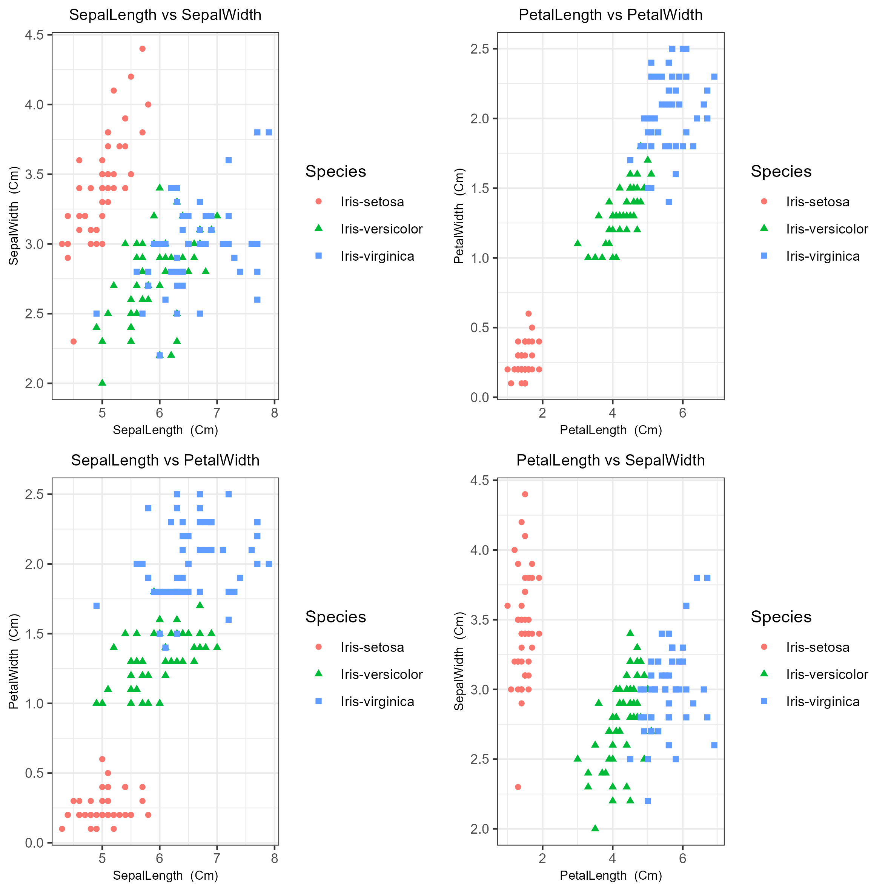

# Iris Analysis


This repository contains source code for univariate, bivariate, multivariate analysis of iris dataset using tidyverse packages in R programming language.

## Prerequisites
Before you can run this project, you need to have the following installed:
- R (version 4.1.1 or later)
- Rstudio (version 1.4.1717 or later)

## Installation
To install this project, follow these steps:
Clone the repository using `git`
```
git clone https://github.com/Prakashdeveloper03/Iris-Analysis.git
```
Navigate to the root directory of the project
```
cd <directory_name>
```
To install all the dependencies
```
Rscript init.R
```
Then Run all scripts in the `script` folder in any order.

## 📷 Sample Output
### Univariate


### Bivariate




### Multivariate
